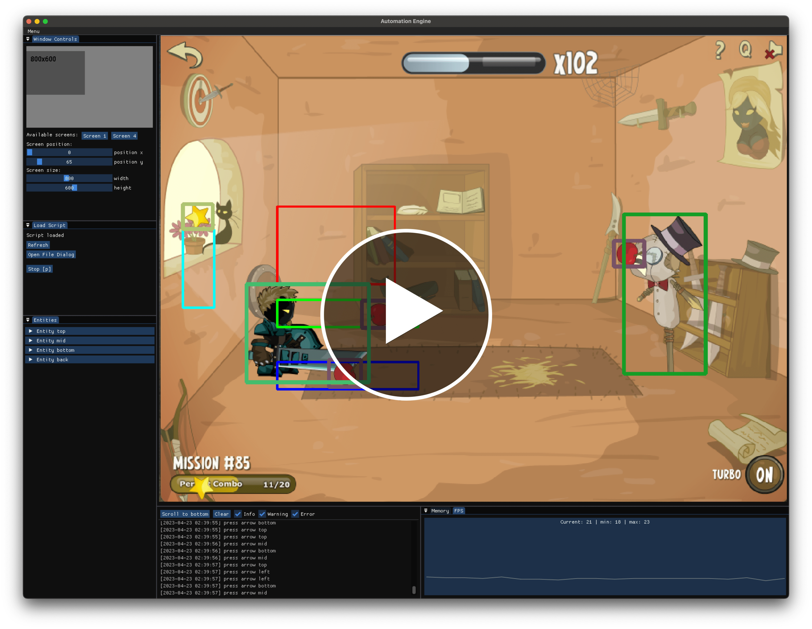
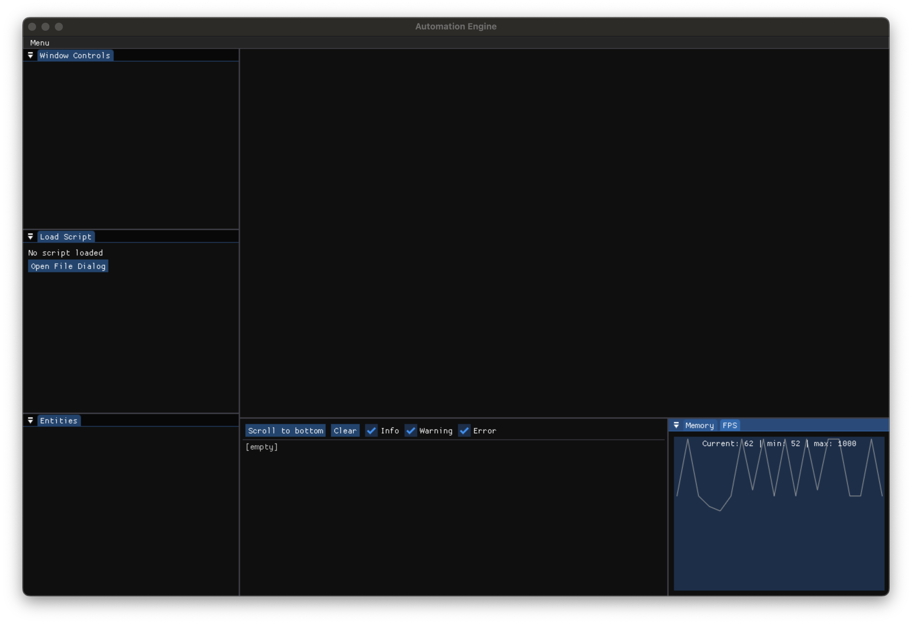
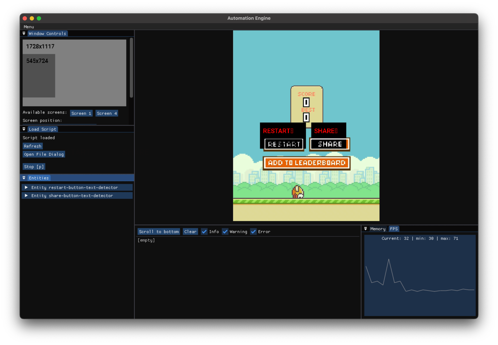
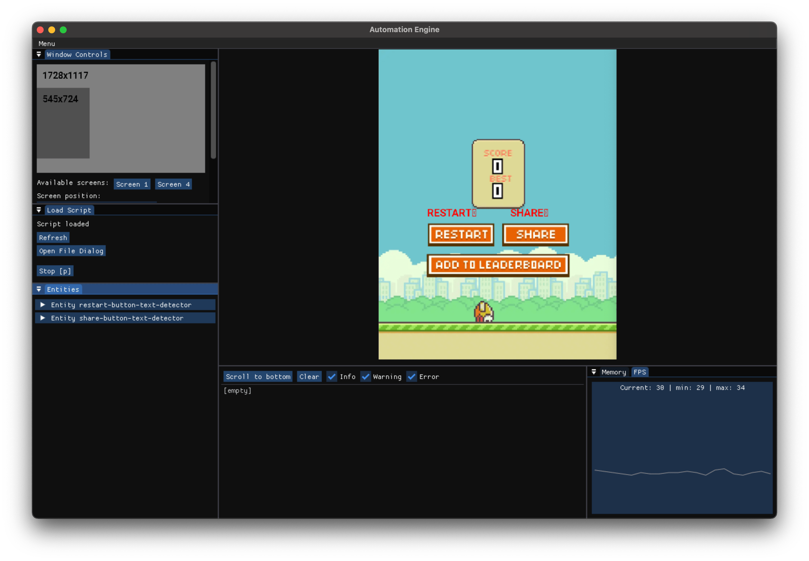
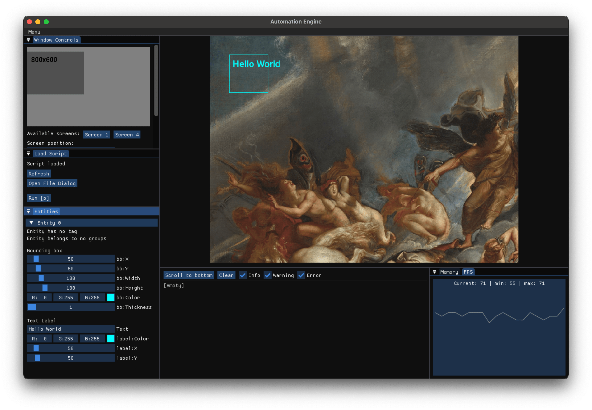
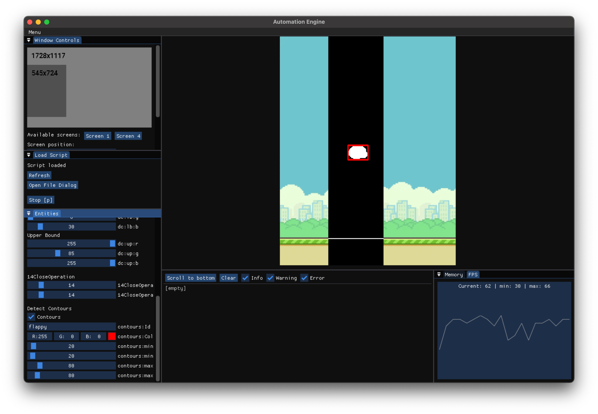
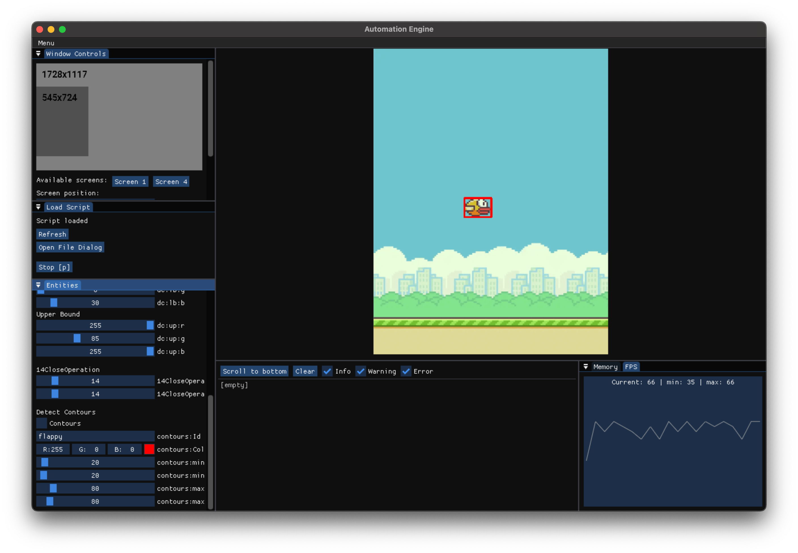
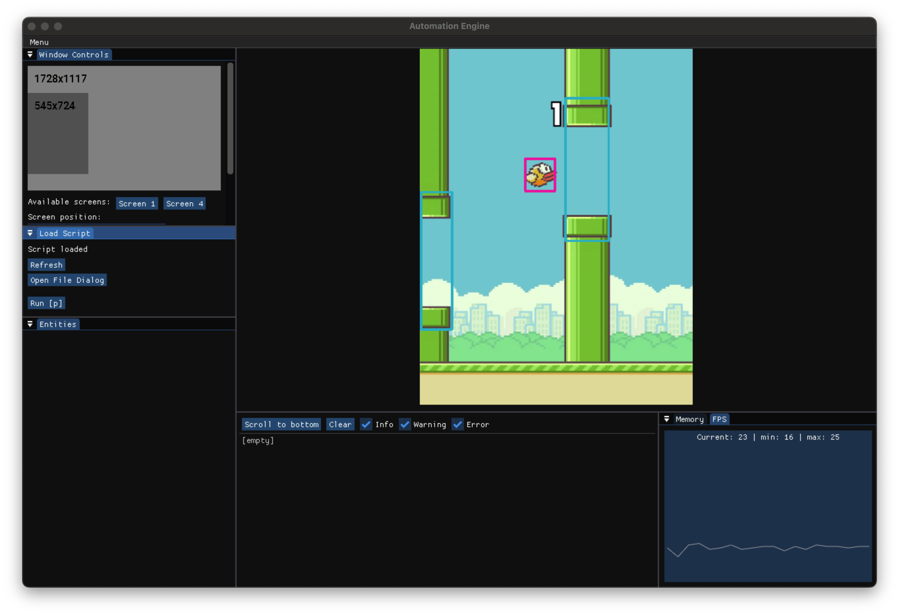
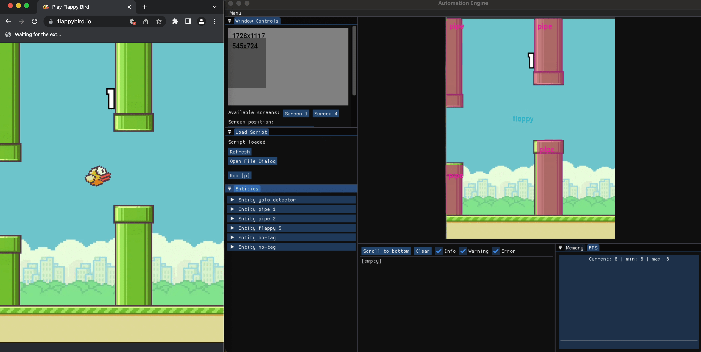

# 🤖 Automation Engine


[](https://svgshare.com/i/ZjP.svg)

## Prologue

Seven years ago (in 2016), I watched [AI play Google's Downosaur](https://youtu.be/P7XHzqZjXQs). Although I don't speak
Portuguese, I was amazed that AI could play the game. After watching similar videos
like [MarI/O](https://youtu.be/qv6UVOQ0F44), I decided to learn how to do something similar.

Other than AI, I was mostly interested in being able to automate simple arcade games just to see how difficult it would
be to write a script that could beat human players or just last longer playing the game and be more efficient
in that way.

I didn't know any programming languages except for PHP and JavaScript, so naturally, I decided to create a JavaScript
application that could do just that. Couple of weekends and a couple
of [hacks](https://stackoverflow.com/questions/48245948/electron-desktopcapturer-to-cv-videocapture-electron-nodejs-opencv4nodejs)
later, I put together Electron, OpenCV4NodeJS, RobotJS, and React in one Webpack bundle and
released [developer239/electron-swords-and-souls-color-bot](https://github.com/developer239/electron-swords-and-souls-color-bot).

## Automation Engine

Fast-forward to 2021, and I decided to step outside of my comfort zone and learn C++ and CMake. Some people
recommended [C++ Game Engine Programming](https://pikuma.com/courses/cpp-2d-game-engine-development) when I asked how to
make a custom game engine. Surprisingly, not only was I able to finish the 30-hour course, but it also gave me
confidence to build something on my own.

When I was deciding about what to build, I remembered my old automation project and chose to rewrite it in C++.
Only the goal was to write general purpose solution and implemented a sort of engine so that I could automate anything
writing simple scripts.

You can find 📚 [TypeScript (Lua) scripts here](https://github.com/developer239/automation-engine-scripts).

[](https://www.youtube.com/watch?v=u59b_5Q-SEs)

## Technologies

### CMake

I wanted to learn how to use CMake and how to write CMakeLists files. All dependencies are
included as git submodules except for SDL2, OpenCV and ONNXRuntime. Currently only MacOS is supported.

```
├── cmake (FindPACKAGE)
│   ├── imgui
│   ├── lua
│   ├── onnx
│   ├── sdl2
│   └── tesseract
└── externals
    ├── googletest
    ├── imgui
    ├── ImGuiFileDialog
    ├── lua
    ├── onnxruntime
    └── sol2

```

The project is also split into `apps` and `packages`. `apps` contains only the automation-engine app at the moment and
in `packages` there are many different modules that should be somewhat easy to reuse in across applications or even
copy paste into different C++ projects.

```
└── src
    ├── apps
    │   └── automation-engine
    │       ├── assets
    │       └── src
    │           ├── components
    │           ├── events
    │           ├── layout
    │           ├── main.cpp
    │           ├── services
    │           ├── strategies
    │           ├── structs
    │           └── systems
    └── packages
        ├── core
        ├── core-imgui
        ├── devices
        ├── ecs
        ├── events
        ├── logger
        ├── utility
        └── yolo
```

### SDL2 & ImGui

GUI is handled by SDL2 and ImGui. SDL2 creates a window and handles input events. ImGui is cloned from docking branch so
that it can provide extra window and docking features. Everything is then rendered inside ImGui windows.



### OpenCV

OpenCV is used for computer vision and for simple image processing to detect objects on the screen using colors
or to make ML object detection or OCR easier. It is also important to note that it is possible to capture selected
screen or specific screen region.


### ONNXRuntime & YOLOv5

YOLOv5 is used for object detection and instance segmentation. In all examples I am using custom trained models.

You can find more information in
separate [yolo-cmake-opencv-onnx-cpp](https://github.com/developer239/yolo-cmake-opencv-onnx-cpp) repository.

### Tesseract

Mostly proof of concept at this point because it is not as performant as I would like it to be. However, it works and it
is possible to detect text in selected parts of the screen.




### Lua & Sol

Sol is to Lua what TypeScript is to JavaScript. Lua is utilized for writing automation scripts that are loaded by the
engine, making it easy to automate various tasks without requiring knowledge of how the engine operates or the need to
write code in C++. As a bonus, it's also possible to write scripts in TypeScript and compile them to Lua
using [TypeScriptToLua](https://typescripttolua.github.io/).

Keep in mind that this has nothing to do with JavaScript or TypeScript in the traditional sense. It is just a way to
write scripts if you don't want to write C++ or Lua.

It is also possible to write scripts in C++ if you update
ScriptingSystem and replace `lua["main"]["onUpdate"]();` with custom logic.

You can find type definitions here: [./automation-engine.d.ts](./automation-engine.d.ts) There is no need for `npm`
package. Treat it like a header file.

```TypeScript
// configure flappy bird detector
const flappyDetector = Registry.Instance().createEntity()

// give entity unique tag
flappyDetector.setTag('flappy-detector')

// make editable in GUI
flappyDetector.addComponentEditable()

// add detection component for morphological operations
flappyDetector.addComponentDetection()
// crop selected area on the screen
flappyDetector.addComponentDetectionCropOperation({
    position: {x: 150, y: 0},
    size: {width: 170, height: 724},
})
// detect flappy bird colors
flappyDetector.addComponentDetectionColorsOperation({
    lowerBound: {r: 0, g: 0, b: 30},
    upperBound: {r: 255, g: 85, b: 255},
})
// close gaps in detected objects
flappyDetector.addComponentDetectionMorphologyOperation('close', {
    size: {width: 14, height: 14},
})

// find contours (only flappy bird should be visible)
flappyDetector.addComponentDetectContours({
    id: 'flappy',
    minArea: {width: 10, height: 10},
    maxArea: {width: 80, height: 80},
    bboxColor: {r: 255, g: 0, b: 0},
    bboxThickness: 3,
    shouldRenderPreview: true
})

// ... create pipes detector

// ... implement collision avoidance logic

main = {
    onUpdate: () => {
        // do something special on every frame
    },
    screen: {
        // region size
        width: 545,
        height: 724,
        // region position
        x: 0,
        y: 243,
    },
}
```

## Installation

As long as `Build & Test` CI is passing it should be easy to make things work.

- `$ brew install pkg-config`
- `$ brew install cmake`
- `$ brew install opencv`
- `$ brew install sdl2`
- `$ brew install sdl2_ttf`
- `$ brew install sdl2_image` (not actually used anywhere right now)
- `$ brew install sdl2_mixer` (not actually used anywhere right now)
- `$ brew install onnxruntime`

## Build & Link

If your IDE supports CMake, you can use that. Otherwise, you can run the following command:

```
$ mkdir build
$ cd build
$ cmake -DCMAKE_BUILD_TYPE=Debug -DCMAKE_MAKE_PROGRAM=$(brew --prefix)/bin/ninja -G Ninja -S . -B build
$ ninja
```

## Development

### ECS

The engine is built on top of custom Entity Component System (inspired
by [C++ Game Engine Programming](https://pikuma.com/courses/cpp-2d-game-engine-development)) the core app logic is
defined in `ECSStrategy.h`.

### ECS Strategy

```c++
class ECSStrategy : public Core::IStrategy {
 public:
  void Init(Core::Window& window, Core::Renderer& renderer) override {
    // initialize fonts and other resources

    //
    // Initialize systems

    // ...

    //
    // Initialize windows

    // ...

    //
    // Subscribe to events

    // ...
  }

  void HandleEvent(SDL_Event& event) override {
      // handle SDL events
  }

  void OnUpdate(Core::Window& window, Core::Renderer& renderer) override {
    // use systems to update what is necessary
  }

  void OnRender(Core::Window& window, Core::Renderer& renderer) override {
    // use systems to render what is necessary
  }

  void OnBeforeRender(Core::Window& window, Core::Renderer& renderer) override {
  }

  void OnAfterRender(Core::Window& window, Core::Renderer& renderer) override {
    // garbage collection for GUI
  }

  ~ECSStrategy() {
    // destroy what is necessary
  }
};

```

### Registry

Singleton class for system and entity component management.

- `ECS::Registry::Instance().CreateEntity()` - creates a new entity
- `ECS::Registry::Instance().KillEntity(entity)` - destroys an entity
- `ECS::Registry::Instance().AddComponent<TComponent>(entity, ...args)` - adds a component to an entity
- `ECS::Registry::Instance().GetComponent<TComponent>(entity)` - gets a component from an entity
- `ECS::Registry::Instance().HasComponent<TComponent>(entity)` - checks if an entity has a component
- `ECS::Registry::Instance().GroupEntity(entity, group)` - assigns an entity to a group
- `ECS::Registry::Instance().GetEntityGroups(group)` - gets all entities in a group
- `ECS::Registry::Instance().TagEntity(entity, tag)` - assigns an entity to a tag
- `ECS::Registry::Instance().GetEntityByTag(tag)` - gets an entity by tag

Example:

<details>
  <summary>C++</summary>

```c++
// Create entity
auto entity = ECS::Registry::Instance().CreateEntity();

// Make entity components editable in GUI for easier debugging
ECS::Registry::Instance().AddComponent<EditableComponent>(entity);

// Show text label on screen
ECS::Registry::Instance().AddComponent<TextLabelComponent>(
  entity,
  "Hello World",
  App::Position(50, 50), // has its own position
  App::Color(0, 255, 255) // has its own color
);

// Show bounding boxes around the component
ECS::Registry::Instance().AddComponent<BoundingBoxComponent>(
  entity,
  App::Position(50, 50),  // has its own position
  App::Size(100, 100),
  App::Color(0, 255, 255)
);
```

</details>
<details>
  <summary>TypeScript</summary>

```TypeScript
// Create entity
const entity = Registry.Instance().createEntity()

// Make entity components editable in GUI for easier debugging
entity.addComponentEditable()

// Show text label on screen
entity.addComponentTextLabel({
    text: 'Hello World',
    position: {x: 50, y: 50},
    color: {r: 0, g: 255, b: 255},
})

// Show bounding boxes around the component
entity.addComponentBoundingBox({
    position: {x: 50, y: 50},
    size: {width: 100, height: 100},
    color: {r: 0, g: 255, b: 255},
    thickness: 2,
})
```

</details>



### Detection Systems

There are multiple ways to detect objects on the screen, such as OCR, OpenCV color detection and finding contours, or
using YOLOv5 object detection or instance segmentation.

The way detection works is that users create entities with detection components, and those entities try to find objects
on the screen and create new entities. For example, with the `flappy-color-detector` below, there will always be one
entity present (the detector entity), and then there will be `n` entities present based on how many objects are
detected.
Object tracking is not yet supported, and detected entities are created and destroyed every frame. ECS uses data
oriented design for fast operations. You can access entities by their group or tag.

#### Flappy Bird Color Detection

<details>
  <summary>C++</summary>

```c++
// Create entity
auto entity = ECS::Registry::Instance().CreateEntity();

// Make entity components editable in GUI for easier debugging
ECS::Registry::Instance().AddComponent<EditableComponent>(entity);

// Add detection component
ECS::Registry::Instance().AddComponent<DetectionComponent>(
  entity,
  DetectionComponent{
    // operations are optional
    // operations are applied in order
    .operations =
      {
        // crop specific region of the screen
        std::make_shared<CropOperation>(
          App::Position(150, 0),
          App::Size(170, 724)
        ),
        // detect colors
        std::make_shared<DetectColorsOperation>(
          App::Color(0, 0, 30),
          App::Color(255, 85, 255)
        ),
        // apply other morphological transformations https://docs.opencv.org/4.x/d9/d61/tutorial_py_morphological_ops.html 
        std::make_shared<CloseOperation>(App::Size(14, 14))}
      }
);

// Add detect contours component for DetectContours system
ECS::Registry::Instance().AddComponent<DetectContoursComponent>(
  entity,
  "flappy-color-detector", // unique ID so that we can have multiple detectors
  App::Size(20, 20), // minimal contour size
  App::Color(255, 0, 0), // bounding box color
  true, // show contours preview in the window stream
  App::Size(80, 80) // maximum contour size
);
```

</details>
<details>
  <summary>TypeScript</summary>

  ```TypeScript
// Create entity
const flappyDetector = Registry.Instance().createEntity()

flappyDetector.setTag('flappy-detector')

// Make entity components editable in GUI for easier debugging
flappyDetector.addComponentEditable()

// Add detection component
flappyDetector.addComponentDetection()

// operations are optional
// operations are applied in order

// crop specific region of the screen
flappyDetector.addComponentDetectionCropOperation({
    position: {x: 150, y: 0},
    size: {width: 170, height: 724},
})
// detect colors
flappyDetector.addComponentDetectionColorsOperation({
    lowerBound: {r: 0, g: 0, b: 30},
    upperBound: {r: 255, g: 85, b: 255},
})
// apply other morphological transformations https://docs.opencv.org/4.x/d9/d61/tutorial_py_morphological_ops.html
flappyDetector.addComponentDetectionMorphologyOperation('close', {
    size: {width: 14, height: 14},
})

// Add detect contours component for DetectContours system
flappyDetector.addComponentDetectContours({
    id: 'flappy',
    minArea: {width: 20, height: 20},
    maxArea: {width: 80, height: 80},
    bboxColor: {r: 255, g: 0, b: 0},
    shouldRenderPreview: false
})
  ```

</details>




#### Flappy Bird YOLO Object Detection

<details>
  <summary>C++</summary>

```c++
// Create Entity
auto entity = ECS::Registry::Instance().CreateEntity();

// AddDetection component
ECS::Registry::Instance().AddComponent<DetectionComponent>(entity);

// Configure YOLO detector
ECS::Registry::Instance().AddComponent<DetectObjectsComponent>(
    entity,
    "object-detector",
    0.9,
    0.5,
    "absolute-path-to-model",
    "absolute-path-to-class-names-file"
);
```

</details>
<details>
  <summary>TypeScript</summary>

  ```TypeScript
// Create Entity
const objectDetector = Registry.Instance().createEntity()

// AddDetection component 
objectDetector.addComponentDetection()

// Configure YOLO detector
objectDetector.addComponentDetectObjects({
    id: 'object-detector',
    confidenceThreshold: 0.9,
    nonMaximumSuppressionThreshold: 0.5,
    pathToModel:
        'absolute-path-to-model',
    pathToClasses:
        'absolute-path-to-class-names-file',
})
  ```

</details>



#### Flappy Bird YOLO Instance Segmentation

It is also possible to load ONNX models to run instance segmentation this allows us to do precise automation logic or more complex image operations like object inpainting (PoC)


