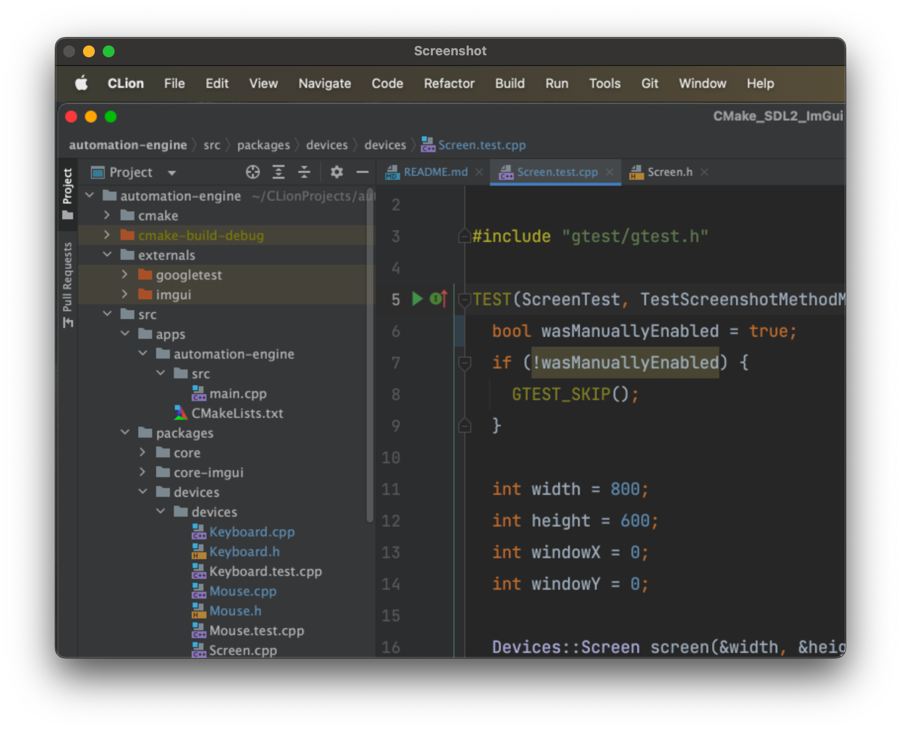

# Automation Engine - Devices

Collection of devices that can be used to automate tasks.

### Keyboard

```cpp
// Type a character
Keyboard.Click('a')

// Type a string
keyboard.Type("hello world");

// Special Keys
keyboard.Enter();
keyboard.Escape();

// Arrow controls
keyboard.ArrowUp();
keyboard.ArrowDown();
keyboard.ArrowLeft();
keyboard.ArrowRight();
```

### Mouse

```cpp
// Move mouse
mouse.Move(100, 100);

// Press buttons
mouse.Click(kCGMouseButtonLeft, true);
mouse.Click(kCGMouseButtonRight, true);
mouse.Click(kCGMouseButtonCenter, true);

// Release buttons
mouse.Click(kCGMouseButtonLeft, false);
mouse.Click(kCGMouseButtonRight, false);
mouse.Click(kCGMouseButtonCenter, false);
```

### Screen

```cpp
int width = 800;
int height = 600;
int windowX = 0;
int windowY = 0;

Devices::Screen screen(&width, &height, &windowX, &windowY);
screen.Screenshot();

cv::imshow("Screenshot", *screen.latestScreenshot);
cv::waitKey(0);
```


